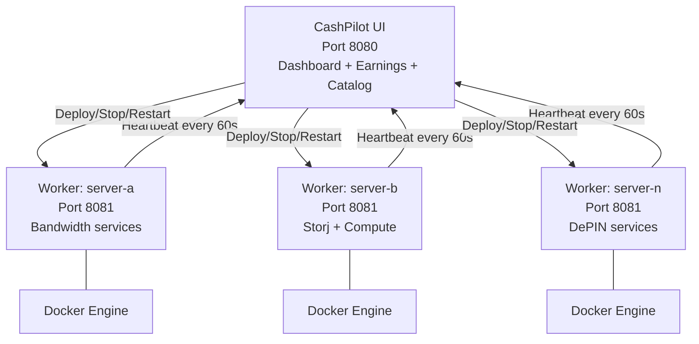

# Multi-Node Fleet Management

For power users running services across multiple servers, CashPilot supports a federated architecture where a single UI aggregates data from workers deployed on each server.

## Topology



## Worker Communication

Workers use **REST HTTP** to communicate with the UI:

- **Heartbeats** (worker → UI): Every 60 seconds, each worker POSTs to `/api/workers/heartbeat` with its container list, system info, and status.
- **Commands** (UI → worker): The UI sends deploy/stop/restart/remove requests to the worker's HTTP API (port 8081).

Workers must be reachable from the UI for commands. The UI must be reachable from workers for heartbeats.

## Setting Up the Fleet

### Main server (UI + local worker)

Use `docker-compose.fleet.yml` on your main server to run both the UI and a local worker:

```bash
docker compose -f docker-compose.fleet.yml up -d
```

### Adding remote workers

On each additional server, deploy only a worker pointing back to the UI:

```yaml
services:
  cashpilot-worker:
    image: drumsergio/cashpilot-worker:latest
    pull_policy: always
    container_name: cashpilot-worker
    # The worker's API is Docker-socket-backed (= root on the host). Bind it to a
    # PRIVATE/VPN interface the UI can reach (e.g. this server's Tailscale IP),
    # never 0.0.0.0 or a public IP. Defaults to loopback if left unset.
    ports:
      - "${CASHPILOT_WORKER_BIND_ADDR:-127.0.0.1}:8081:8081"
    volumes:
      - /var/run/docker.sock:/var/run/docker.sock
      - cashpilot_worker_data:/data
    environment:
      - TZ=Europe/Madrid
      - CASHPILOT_UI_URL=http://main-server:8080
      - CASHPILOT_API_KEY=your-shared-api-key
      - CASHPILOT_WORKER_NAME=server-b
      - CASHPILOT_WORKER_URL=http://server-b:8081
    restart: unless-stopped
    security_opt:
      - no-new-privileges:true

volumes:
  cashpilot_worker_data:
```

!!! important "CASHPILOT_WORKER_URL"
    Set this to the address the UI should use to reach this worker (e.g. its LAN IP or Tailscale MagicDNS name, port 8081). Without it, the worker auto-detects its own outbound IP, which inside a container is often the Docker bridge address -- unreachable from the UI on another host.

!!! important "API Key"
    The `CASHPILOT_API_KEY` must be identical on the UI and all workers. It is the **enrollment key** each worker uses on first contact; after that, each worker uses its own automatically-issued key.

## Authentication

CashPilot uses **per-worker fleet keys** (since v1.0.0). The shared `CASHPILOT_API_KEY` is only a bootstrap/enrollment credential; each worker then gets its own key.

- Set `CASHPILOT_API_KEY` on the UI and all workers (or let the UI + co-located worker auto-generate one via the `/fleet` volume).
- **Enrollment:** a worker's first heartbeat authenticates with the shared key. The UI issues that worker its own unique key (stored encrypted on the UI, and returned once). The worker persists it under its private `/data`.
- **After enrollment:** the worker authenticates every heartbeat with its own key, and the UI calls that worker with the same key. The shared key **no longer works** for an enrolled worker — so a leaked worker key only affects that one worker, and no worker can impersonate another.

The fleet key is **never sent to the browser on page load**. The fleet dashboard reveals it only on an explicit, owner-only action (the **Reveal API Key** button), and copy-to-clipboard fetches it the same way.

!!! warning "Security"
    Keys grant container-management access — treat them as sensitive credentials, and never expose worker APIs (port 8081) to the public internet. See the [v1.0.0 upgrade guide](upgrade-v1.md) if you are moving an existing fleet.

## Fleet Dashboard

The UI's fleet dashboard shows:

- All connected workers with online/offline status and "last seen" timestamps
- Per-worker container list with health, CPU, memory, and uptime
- Remote action buttons (deploy, stop, restart, remove) targeting any worker
- Aggregated earnings across all workers

Services running on multiple workers show expandable rows with per-instance details. The main row displays averaged CPU/memory (prefixed with `~`), and sub-rows show individual worker values.

## Cross-Subnet Workers

If the worker and UI are on different subnets (e.g., connected via Tailscale):

1. The UI server must advertise its subnet: `tailscale set --advertise-routes=<UI-subnet>`
2. The worker server must accept routes: `tailscale set --accept-routes=true`
3. The worker uses the UI's LAN IP in `CASHPILOT_UI_URL` (not the Tailscale IP)

## Offline Handling

If a worker goes offline (no heartbeat for 180 seconds):

- The UI marks the worker as offline
- Historical earnings and health data is retained
- The worker reconnects automatically when back online
- Container status updates resume immediately after reconnection

## Environment Variables Reference

### UI

| Variable | Default | Description |
|----------|---------|-------------|
| `CASHPILOT_API_KEY` | *(auto-generated via /fleet volume)* | Shared secret for worker authentication |
| `CASHPILOT_SECRET_KEY` | *(auto-generated)* | Encryption key for stored credentials |
| `CASHPILOT_ADMIN_API_KEY` | -- | Optional separate key granting full owner access (for integrations) |
| `CASHPILOT_WORKER_URL_POLICY` | `permissive` | Worker URL validation policy: `permissive` (LAN + Tailscale work out of the box) or `strict` (allowlist only) |
| `CASHPILOT_WORKER_ALLOWED_HOSTS` | -- | Comma-separated CIDRs and `*.suffix` hostnames allowed in `strict` mode, e.g. `192.168.10.0/24,100.64.0.0/10,*.ts.net` |
| `CASHPILOT_WORKER_ALLOW_METADATA` | `false` | Escape hatch to permit cloud-metadata IPs as worker targets (leave `false`) |

### Worker

| Variable | Required | Default | Description |
|----------|:--------:|---------|-------------|
| `CASHPILOT_UI_URL` | Yes | -- | URL of the CashPilot UI (e.g. `http://192.168.10.100:8080`) |
| `CASHPILOT_API_KEY` | Yes | -- | Must match the UI's API key |
| `CASHPILOT_WORKER_NAME` | No | *(hostname)* | Display name for this worker in the fleet dashboard |
| `CASHPILOT_WORKER_URL` | No | *(auto-detected)* | URL the UI uses to reach this worker. Set explicitly for remote/cross-host workers -- auto-detection can report an unreachable address |
| `CASHPILOT_PORT` | No | `8081` | Mini-UI/API port the worker listens on |

### Worker URL Validation

The UI validates every worker URL before contacting it (the URL is fetched with the fleet bearer token attached, so an unchecked URL is an SSRF risk). Cloud-metadata addresses and loopback/link-local ranges are **always blocked**, and resolved hostnames are re-checked against the same rules to guard against DNS rebinding.

- **`permissive`** (default): LAN (RFC1918) and Tailscale (CGNAT `100.64.0.0/10`) workers keep working with no configuration. Only the always-blocked ranges are rejected.
- **`strict`**: workers must match `CASHPILOT_WORKER_ALLOWED_HOSTS`. Entries are either CIDRs (`192.168.10.0/24`) or hostname suffixes (`*.ts.net`).

!!! important "Tailscale in strict mode"
    If you use Tailscale and enable `strict` mode, include `100.64.0.0/10` in `CASHPILOT_WORKER_ALLOWED_HOSTS` (and/or `*.ts.net` for MagicDNS names). Without it, Tailscale workers are rejected.
