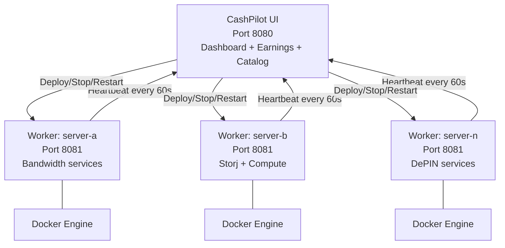

# Multi-Node Fleet Management

For power users running services across multiple servers, CashPilot supports a federated architecture where a single UI aggregates data from workers deployed on each server.

## Topology



## Worker Communication

Workers use **REST HTTP** to communicate with the UI:

- **Heartbeats** (worker → UI): Every 60 seconds, each worker POSTs to `/api/workers/heartbeat` with its container list, system info, and status.
- **Commands** (UI → worker): The UI sends deploy/stop/restart/remove requests to the worker's HTTP API (port 8081).

Workers must be reachable from the UI for commands. The UI must be reachable from workers for heartbeats.

## Setting Up the Fleet

### Main server (UI + local worker)

Use `docker-compose.fleet.yml` on your main server to run both the UI and a local worker:

```bash
docker compose -f docker-compose.fleet.yml up -d
```

### Adding remote workers

On each additional server, deploy only a worker pointing back to the UI:

```yaml
services:
  cashpilot-worker:
    image: drumsergio/cashpilot-worker:latest
    container_name: cashpilot-worker
    ports:
      - "8081:8081"
    volumes:
      - /var/run/docker.sock:/var/run/docker.sock
      - cashpilot_worker_data:/data
    environment:
      - TZ=Europe/Madrid
      - CASHPILOT_UI_URL=http://main-server:8080
      - CASHPILOT_API_KEY=your-shared-api-key
      - CASHPILOT_WORKER_NAME=server-b
    restart: unless-stopped
    security_opt:
      - no-new-privileges:true

volumes:
  cashpilot_worker_data:
```

!!! important "API Key"
    The `CASHPILOT_API_KEY` must be identical on the UI and all workers. This is the shared secret that authenticates worker-to-UI communication.

## Authentication

A single shared API key authenticates all fleet communication:

- Set `CASHPILOT_API_KEY` on both the UI and all workers.
- Workers include this key as a Bearer token in heartbeat requests.
- The UI includes this key when sending commands to workers.
- If not set explicitly, the UI and co-located worker auto-generate a shared key via the `/fleet` volume.

!!! warning "Security"
    The fleet key grants access to container management operations. Treat it as a sensitive credential. Do not expose worker APIs (port 8081) to the public internet.

## Fleet Dashboard

The UI's fleet dashboard shows:

- All connected workers with online/offline status and "last seen" timestamps
- Per-worker container list with health, CPU, memory, and uptime
- Remote action buttons (deploy, stop, restart, remove) targeting any worker
- Aggregated earnings across all workers

Services running on multiple workers show expandable rows with per-instance details. The main row displays averaged CPU/memory (prefixed with `~`), and sub-rows show individual worker values.

## Cross-Subnet Workers

If the worker and UI are on different subnets (e.g., connected via Tailscale):

1. The UI server must advertise its subnet: `tailscale set --advertise-routes=<UI-subnet>`
2. The worker server must accept routes: `tailscale set --accept-routes=true`
3. The worker uses the UI's LAN IP in `CASHPILOT_UI_URL` (not the Tailscale IP)

## Offline Handling

If a worker goes offline (no heartbeat for 180 seconds):

- The UI marks the worker as offline
- Historical earnings and health data is retained
- The worker reconnects automatically when back online
- Container status updates resume immediately after reconnection

## Environment Variables Reference

### UI

| Variable | Default | Description |
|----------|---------|-------------|
| `CASHPILOT_API_KEY` | *(auto-generated via /fleet volume)* | Shared secret for worker authentication |
| `CASHPILOT_SECRET_KEY` | *(auto-generated)* | Encryption key for stored credentials |
| `CASHPILOT_ADMIN_API_KEY` | -- | Optional separate key granting full owner access (for integrations) |

### Worker

| Variable | Required | Default | Description |
|----------|:--------:|---------|-------------|
| `CASHPILOT_UI_URL` | Yes | -- | URL of the CashPilot UI (e.g. `http://192.168.10.100:8080`) |
| `CASHPILOT_API_KEY` | Yes | -- | Must match the UI's API key |
| `CASHPILOT_WORKER_NAME` | No | *(hostname)* | Display name for this worker in the fleet dashboard |
