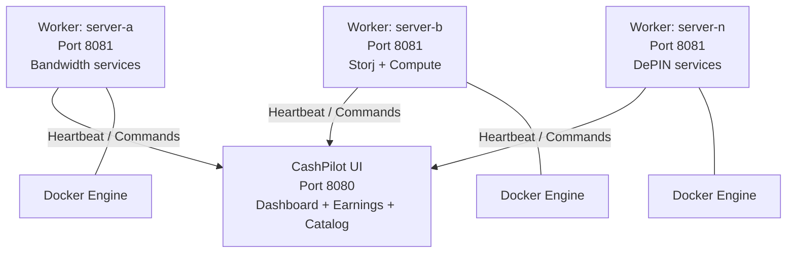

# Multi-Node Fleet Management

For power users running services across multiple servers, CashPilot supports a federated architecture where a single UI aggregates data from workers deployed on each server.

## Topology



Each worker connects **outbound** to the UI via HTTP -- no port forwarding needed on the worker side. The UI's fleet dashboard shows all connected workers, their containers, and live status. The UI can push commands (deploy, stop, restart) to any worker remotely.

## Instance Modes

CashPilot supports a 2x2 matrix of deployment modes:

| | **Docker: direct** (socket mounted) | **Docker: monitor-only** (no socket) |
|---|---|---|
| **Master** | Full management + fleet aggregation | Fleet aggregation + compose export (containers managed externally) |
| **Child** | Local management + reports to master | Earnings tracking only + reports to master |

A child in monitor-only mode is useful when containers are managed by Portainer or manual compose, but you still want CashPilot's earnings collection and fleet-wide visibility.

## Setting Up the Fleet

### Main server (UI + local worker)

Use `docker-compose.fleet.yml` on your main server to run both the UI and a local worker:

```bash
docker compose -f docker-compose.fleet.yml up -d
```

### Adding remote workers

On each additional server, deploy only a worker pointing back to the UI:

```yaml
services:
  cashpilot-worker:
    image: drumsergio/cashpilot-worker:latest
    container_name: cashpilot-worker
    ports:
      - "8081:8081"
    volumes:
      - /var/run/docker.sock:/var/run/docker.sock
      - cashpilot_worker_data:/data
    environment:
      - TZ=Europe/Madrid
      - CASHPILOT_UI_URL=http://main-server:8080
      - CASHPILOT_API_KEY=your-shared-api-key
      - CASHPILOT_WORKER_NAME=server-b
    restart: unless-stopped
    security_opt:
      - no-new-privileges:true

volumes:
  cashpilot_worker_data:
```

!!! important "API Key"
    The `CASHPILOT_API_KEY` must be identical on the UI and all workers. This is the shared secret that authenticates worker-to-UI communication.

## Authentication

Two authentication methods are supported:

- **Master key** -- Persistent, derived from the secret key. Used for long-lived worker connections.
- **Join tokens** -- HMAC-signed, time-limited, reusable. Generated from the UI for easy worker onboarding.

### Worker setup flow

1. Generate a join token from the UI's fleet settings.
2. Set `CASHPILOT_MASTER_URL` and `CASHPILOT_JOIN_TOKEN` on the worker.
3. Restart the worker -- it connects and registers automatically.

## Worker Communication

Workers use **outbound WebSocket** connections to the master:

- Heartbeats every 30 seconds: container list, OS, arch, Docker version, earnings
- Master can push commands: deploy, stop, restart, remove, status
- Automatic reconnect with exponential backoff (1s to 300s max)

!!! tip "NAT-Friendly"
    Workers initiate all connections outbound. No port forwarding, VPN, or reverse tunnels needed on the worker side. Works behind any firewall or NAT.

## Fleet Dashboard

The master's fleet dashboard shows:

- All connected nodes with online/offline status and "last seen" timestamps
- Per-node container list with health, CPU, memory, and uptime
- Remote action buttons (deploy, stop, restart, remove) targeting any node
- Aggregated earnings across all nodes

Services running on multiple nodes show expandable rows with per-instance details. The main row displays averaged CPU/memory (prefixed with `~`), and sub-rows show individual node values.

## Cross-Subnet Workers

If the worker and UI are on different subnets (e.g., connected via Tailscale):

1. The UI server must advertise its subnet: `tailscale set --advertise-routes=<UI-subnet>`
2. The worker server must accept routes: `tailscale set --accept-routes=true`
3. The worker uses the UI's LAN IP in `CASHPILOT_UI_URL` (not the Tailscale IP)

## Offline Handling

If a worker goes offline:

- The UI shows "last seen X ago" for that server's containers
- Historical earnings and health data is retained
- The worker reconnects automatically when back online
- Container status updates resume immediately after reconnection

## Environment Variables Reference

### UI (Master)

| Variable | Default | Description |
|----------|---------|-------------|
| `CASHPILOT_ROLE` | `master` | Set to `master` to enable fleet dashboard |
| `CASHPILOT_API_KEY` | -- | Shared secret for worker authentication |
| `CASHPILOT_SECRET_KEY` | *(auto-generated)* | Encryption key for credentials and master key derivation |

### Worker (Child)

| Variable | Required | Default | Description |
|----------|:--------:|---------|-------------|
| `CASHPILOT_UI_URL` | Yes | -- | URL of the CashPilot UI (e.g. `http://192.168.10.100:8080`) |
| `CASHPILOT_API_KEY` | Yes | -- | Must match the UI's API key |
| `CASHPILOT_WORKER_NAME` | No | *(hostname)* | Display name for this worker in the fleet dashboard |
| `CASHPILOT_MASTER_URL` | No | -- | WebSocket URL for federation (e.g. `ws://192.168.10.100:8080`) |
| `CASHPILOT_JOIN_TOKEN` | No | -- | Time-limited join token from the master |
