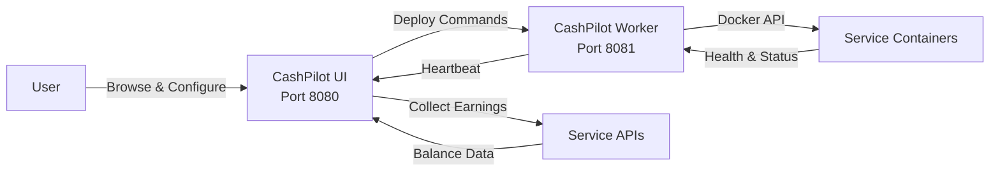

# Getting Started

## Prerequisites

- **Docker** and **Docker Compose** installed on your server
- A Linux, macOS, or Windows host (amd64 or arm64)
- At least 1 GB of RAM available for CashPilot + managed services

## Quick Start

### 1. Clone and launch

```bash
git clone https://github.com/GeiserX/CashPilot.git
cd CashPilot
docker compose up -d
```

This starts two containers:

| Container | Port | Purpose |
|-----------|------|---------|
| **cashpilot-ui** | 8080 | Web dashboard, earnings collection, service catalog |
| **cashpilot-worker** | 8081 | Docker agent that deploys and monitors service containers |

### 2. Open the dashboard

Navigate to [http://localhost:8080](http://localhost:8080) in your browser. The onboarding wizard will guide you through initial setup.

### 3. Browse the service catalog

Filter services by category (bandwidth, DePIN, storage, compute), view earning estimates, and check requirements before deploying.

### 4. Sign up for services

Each service card has a signup link. Create accounts on the services you want to run.

### 5. Enter credentials and deploy

The setup wizard collects only the credentials each service needs (email/password, API token, etc.). Click **Deploy** and CashPilot handles the rest -- pulling images, creating containers, and starting health monitoring.

## How It Works



1. **You configure** services through the web UI -- pick a service, enter credentials, click deploy.
2. **The UI sends** the container spec (image, env vars, volumes) to the worker via REST API.
3. **The worker creates** the Docker container and starts monitoring its health.
4. **The worker reports** container status back to the UI every 60 seconds via heartbeats.
5. **The UI collects** earnings from service APIs on a configurable schedule (default: every hour).
6. **The dashboard** shows aggregated earnings, per-service breakdowns, and container health.

## Configuration

### UI Environment Variables

| Variable | Default | Description |
|----------|---------|-------------|
| `TZ` | `UTC` | Timezone for scheduling and display |
| `CASHPILOT_SECRET_KEY` | *(auto-generated)* | Encryption key for stored credentials. Set this to persist encryption across container recreations |
| `CASHPILOT_API_KEY` | -- | Shared secret between UI and workers for API authentication |
| `CASHPILOT_COLLECTION_INTERVAL` | `3600` | Seconds between earnings collection cycles |
| `CASHPILOT_PORT` | `8080` | Web UI port inside the container |

### Worker Environment Variables

| Variable | Default | Description |
|----------|---------|-------------|
| `TZ` | `UTC` | Timezone |
| `CASHPILOT_UI_URL` | -- | URL of the UI container, e.g. `http://cashpilot-ui:8080` |
| `CASHPILOT_API_KEY` | -- | Must match the UI's API key |
| `CASHPILOT_WORKER_NAME` | *(hostname)* | Display name for this worker in the fleet dashboard |

### Docker Compose Example

```yaml
services:
  cashpilot-ui:
    image: drumsergio/cashpilot:latest
    container_name: cashpilot-ui
    ports:
      - "8080:8080"
    volumes:
      - cashpilot_data:/data
    environment:
      - TZ=Europe/Madrid
      - CASHPILOT_API_KEY=your-secret-api-key
      - CASHPILOT_SECRET_KEY=your-encryption-key
    restart: unless-stopped

  cashpilot-worker:
    image: drumsergio/cashpilot-worker:latest
    container_name: cashpilot-worker
    ports:
      - "8081:8081"
    volumes:
      - /var/run/docker.sock:/var/run/docker.sock
      - cashpilot_worker_data:/data
    environment:
      - TZ=Europe/Madrid
      - CASHPILOT_UI_URL=http://cashpilot-ui:8080
      - CASHPILOT_API_KEY=your-secret-api-key
    restart: unless-stopped
    security_opt:
      - no-new-privileges:true

volumes:
  cashpilot_data:
  cashpilot_worker_data:
```

!!! warning "Docker Socket Access"
    The worker container requires access to `/var/run/docker.sock` to manage service containers. This grants the worker significant privileges on the host. Run CashPilot on a dedicated machine or VLAN for best security.

!!! tip "Secret Key Persistence"
    If you don't set `CASHPILOT_SECRET_KEY`, one is auto-generated on first run and stored in the data volume. If you recreate the volume, stored credentials become unreadable. Set an explicit key in your compose file to avoid this.

## Supported Services

CashPilot tracks **49 services** across four categories:

- **Bandwidth Sharing** (22 services) -- Share your internet bandwidth for passive income
- **DePIN** (20 services) -- Decentralized physical infrastructure networks
- **GPU Compute** (6 services) -- Rent out your GPU for AI and compute workloads
- **Storage** (1 service) -- Share disk space on decentralized storage networks

Of these, **16 services** can be deployed and managed automatically via Docker. The rest are browser extension or desktop-only services tracked in the catalog with signup links and earning estimates.

Browse the full catalog in the [Service Guides](guides/README.md) section.

## Next Steps

- [Architecture](architecture.md) -- Understand the UI + Worker split design
- [Fleet Management](fleet.md) -- Deploy across multiple servers
- [Service Guides](guides/README.md) -- Detailed setup instructions for each service
