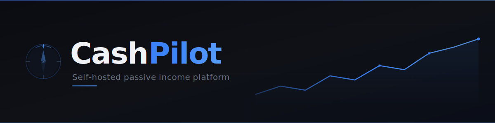

---
hide:
  - navigation
---

# CashPilot

<p align="center">
  
</p>

<p align="center">
  <a href="https://hub.docker.com/r/drumsergio/cashpilot"></a>
  <a href="https://github.com/GeiserX/CashPilot/stargazers"></a>
  <a href="https://github.com/GeiserX/CashPilot/blob/main/LICENSE"></a>
</p>

---

**CashPilot** is a self-hosted platform that lets you deploy, manage, and monitor passive income services from a single web interface. Instead of manually setting up dozens of Docker containers, configuring credentials, and checking multiple dashboards, CashPilot handles everything from one place.

It supports both **Docker-based services** (deployed and managed automatically) and **browser extension / desktop-only services** (tracked via the web UI with signup links, earning estimates, and balance monitoring). Whether a service runs in a container or in your browser, CashPilot aggregates all your earnings into a unified dashboard with historical tracking.

## Features

<div class="grid cards" markdown>

-   :material-wizard-hat: **Web-Based Setup Wizard**

    ---

    Guided account creation for each service. No CLI or YAML editing needed.

-   :material-rocket-launch: **One-Click Container Deployment**

    ---

    Deploy 16+ passive income services with a single click from the browser.

-   :material-chart-line: **Real-Time Earnings Dashboard**

    ---

    Historical charts, trend analysis, and per-service breakdowns with progress toward payout.

-   :material-heart-pulse: **Container Health Monitoring**

    ---

    CPU, memory, network, uptime, and health scores at a glance.

-   :material-server-network: **Multi-Node Fleet Management**

    ---

    Run services across multiple servers. One UI aggregates everything.

-   :material-shield-lock: **Credential Encryption**

    ---

    All credentials encrypted at rest with Fernet symmetric encryption.

-   :material-view-grid: **49 Services, 4 Categories**

    ---

    Bandwidth sharing, DePIN, storage, and GPU compute -- the broadest catalog available.

-   :material-cellphone: **Mobile-Responsive Dark UI**

    ---

    Manage your fleet from any device with a modern dark theme.

</div>

## Dashboard


## Quick Start

```bash
docker compose up -d
# Open http://localhost:8080
```

This starts two containers:

- **cashpilot-ui** -- Web dashboard, earnings collection, service catalog (port 8080)
- **cashpilot-worker** -- Docker agent that deploys and monitors service containers (port 8081)

Then open [http://localhost:8080](http://localhost:8080) and follow the setup wizard.

!!! note
    The worker container requires access to the Docker socket (`/var/run/docker.sock`) to deploy and manage service containers. Both containers are required for full functionality.

[Get Started](getting-started.md){ .md-button .md-button--primary }
[View on GitHub](https://github.com/GeiserX/CashPilot){ .md-button }

## How CashPilot Compares

| Feature | CashPilot | money4band | CashFactory | income-generator | InternetIncome |
|---------|:---------:|:----------:|:-----------:|:----------------:|:--------------:|
| Web UI with guided setup | **Yes** | No (CLI) | Partial (links only) | No (CLI) | No (CLI) |
| One-click container deploy | **Yes** | No (compose) | No (compose) | No | No (compose) |
| Earnings dashboard | **Yes** | No | No | No | No |
| Historical charts | **Yes** | No | No | No | No |
| Multi-node fleet management | **Yes** | No | No | No | No |
| Service catalog with guides | **49 services** | 17 | 8 | 14 | 8 |
| Automated earnings collection | **13 collectors** | 0 | 0 | 0 | 0 |
| Multi-arch (amd64 + arm64) | **Yes** | Yes | Yes | No | No |
| Credential encryption | **Yes** | No | No | No | No |
| Compose export | **Yes** | Yes | Yes | Yes | Yes |

## FAQ

??? question "Is bandwidth sharing safe?"
    Bandwidth sharing services generally route legitimate traffic (market research, ad verification, price comparison, content delivery) through your connection. That said, you are sharing your IP address, so review each service's terms of service and privacy policy carefully before signing up. Running these on a VPS rather than residential IP is an option for some services. **This is not legal advice.**

??? question "How much can I earn?"
    Earnings vary widely based on location, number of devices, and which services you run. A realistic expectation for a single residential server running 10-15 services is **$30 - $100/month**. Adding more servers or GPU compute services can increase this significantly. The dashboard shows your actual earnings over time so you can optimize.

??? question "Can I run on a VPS or cloud server?"
    Some services require a residential IP and will not pay (or will ban) VPS/datacenter IPs. These are marked as "Residential Only" in the service catalog. Services that work on VPS are a good way to scale up without additional home hardware.

??? question "How are credentials stored?"
    All service credentials are encrypted at rest in the SQLite database using your `CASHPILOT_SECRET_KEY`. The database file lives in the mounted Docker volume. No credentials are ever sent anywhere except to the service containers themselves.

??? question "What about security?"
    Every service CashPilot deploys runs inside its own isolated Docker container with `--security-opt no-new-privileges`. Service credentials are encrypted at rest using Fernet symmetric encryption. Only the worker container requires Docker socket access; the UI container has no privileged access. We recommend running CashPilot on a dedicated machine or VLAN and keeping Docker and your host OS up to date.

??? question "What happens if a service container crashes?"
    CashPilot monitors container health continuously. If a service container exits unexpectedly, it is automatically restarted. The dashboard shows uptime and health status for every running service.

## Disclosure

!!! info "Referral Links"
    This project contains affiliate/referral links. If you sign up through these links, the project maintainer may earn a small commission at no extra cost to you. You are free to replace all referral codes with your own in the Settings page.

## License

[GPL-3.0](https://github.com/GeiserX/CashPilot/blob/main/LICENSE) -- Sergio Fernandez, 2026
