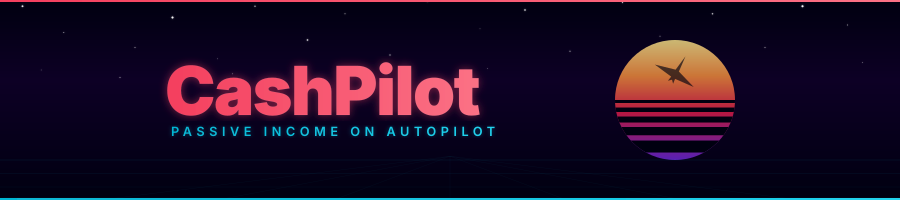
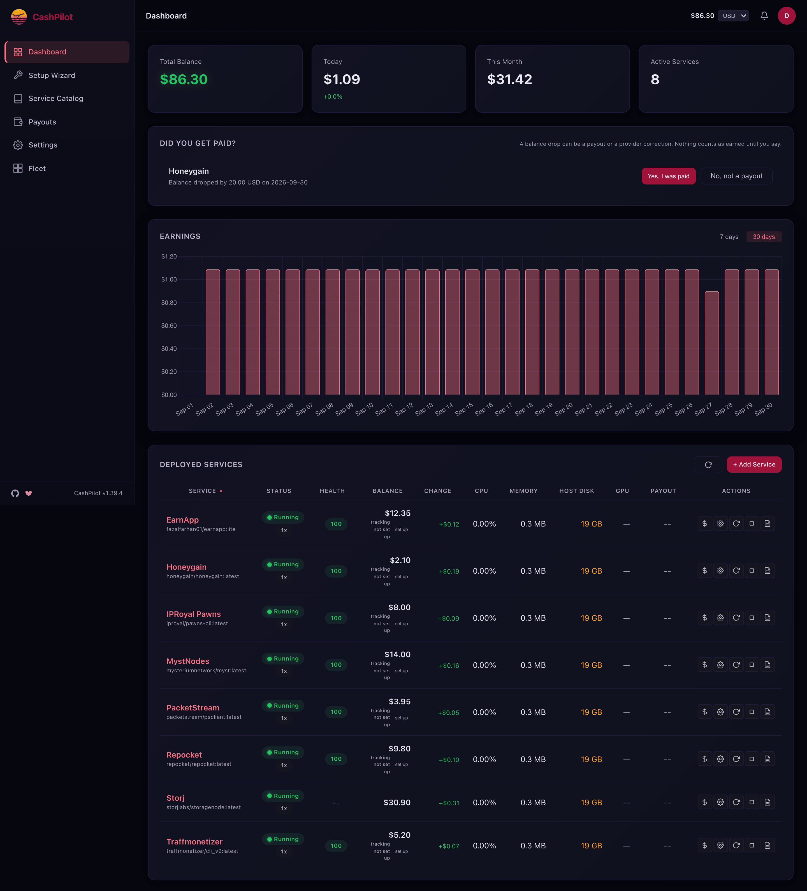
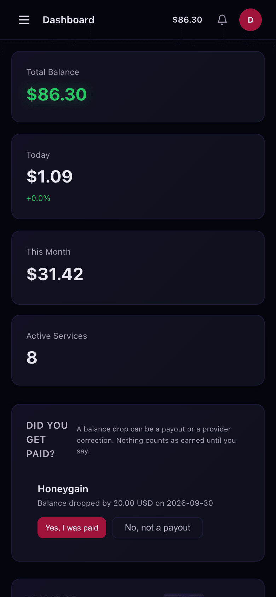
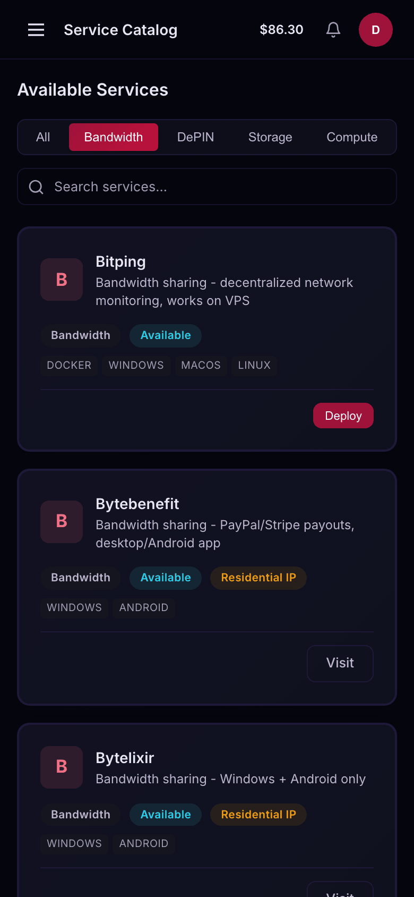
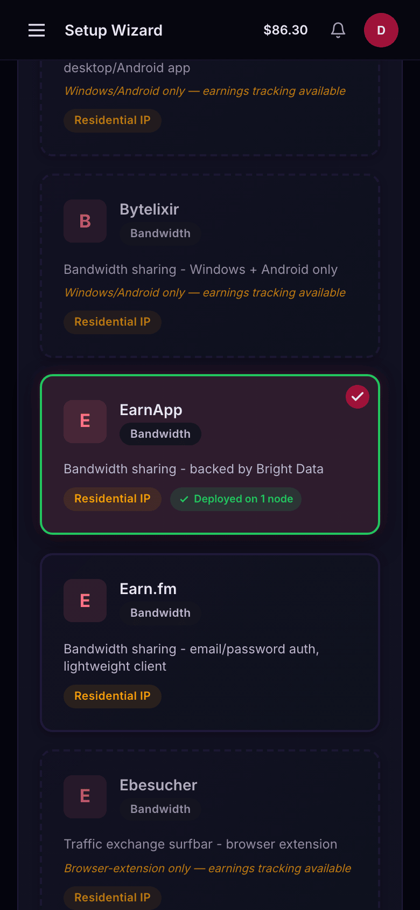
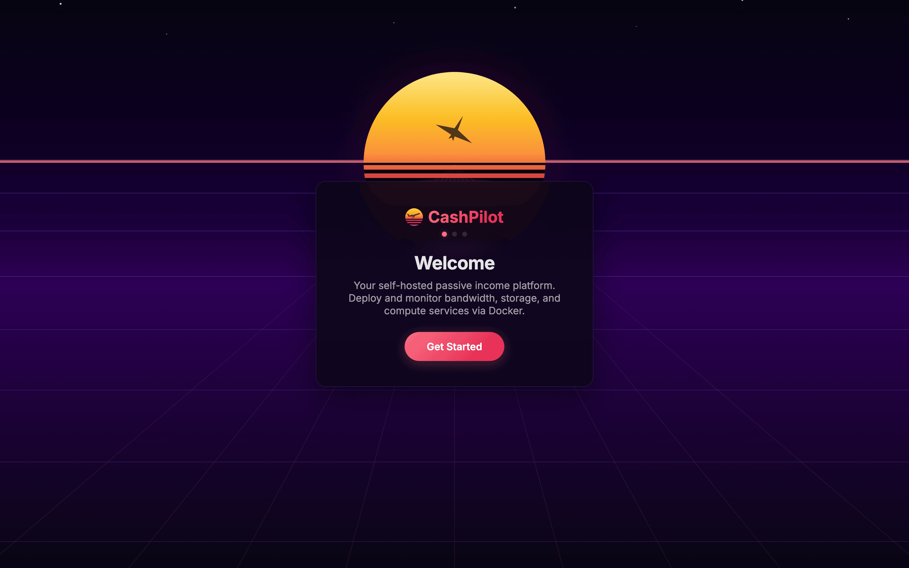
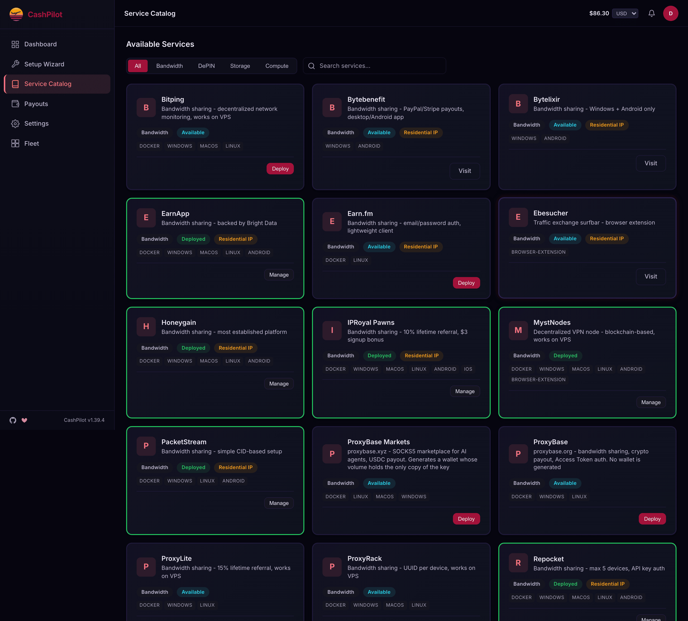
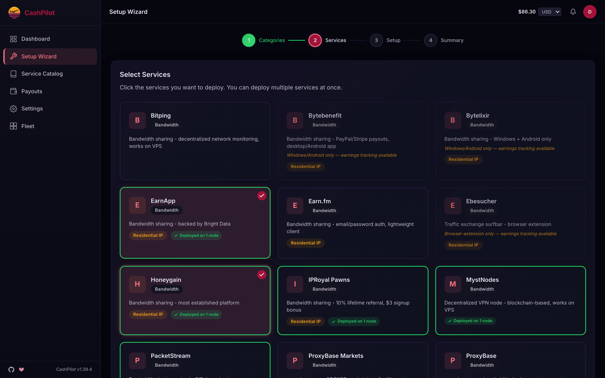
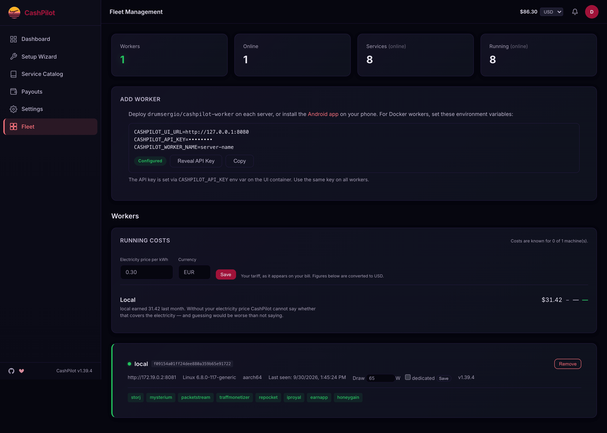
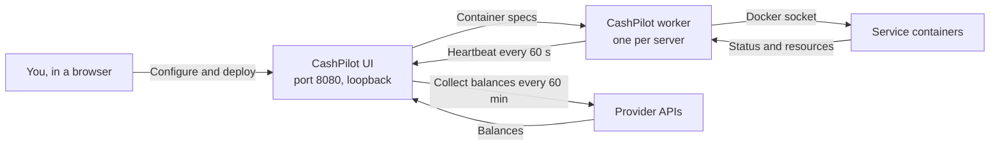

---
hide:
  - navigation
  - toc
---

# CashPilot { .cp-visually-hidden }

  

  
  
  
  

---

**CashPilot** runs passive income services on your own servers and shows what they earn in one dashboard. It is two Docker containers: a UI that holds the catalog, the credentials and the earnings history, and a worker on each server that starts and watches the service containers. Start with [Getting started](getting-started.md), then pick services in the [Service guides](guides/index.md).

-   :material-docker: **[Getting started](getting-started.md)**

    ---

    Fetch the compose file, start the two containers, create the owner account with the setup token.

-   :material-view-grid-outline: **[Service guides](guides/index.md)**

    ---

    50 services: what each one needs, whether it runs in Docker, the payout minimum, and a setup guide.

-   :material-server-network: **[Fleet management](fleet.md)**

    ---

    One worker per server, one dashboard for all of them, every figure per server and per service.

-   :material-format-list-bulleted: **[Configuration reference](configuration.md)**

    ---

    Every setting, its default, and which source wins when two disagree.

## The dashboard

The dashboard is what you look at every day: the balances, a 7-day or 30-day earnings chart, the payouts waiting for your confirmation, and every deployed service with its status, balance, CPU and memory. Collectors read the balances of 15 providers every hour; the rest you enter by hand.

<figure markdown>

<figcaption>The dashboard on a phone</figcaption>
</figure>
<figure markdown>

<figcaption>The catalog</figcaption>
</figure>
<figure markdown>

<figcaption>The setup wizard</figcaption>
</figure>

<figure markdown>

<figcaption>First run: the welcome page asks for the setup token from the log</figcaption>
</figure>
<figure markdown>

<figcaption>The catalog: 50 services, filterable by category</figcaption>
</figure>
<figure markdown>

<figcaption>The wizard: pick categories, pick services, enter credentials, deploy</figcaption>
</figure>
<figure markdown>

<figcaption>The fleet: every worker, its host, and how to add the next one</figcaption>
</figure>

## What it runs

- **16 services run in Docker**, started by the worker from the catalog: no compose file to write. Bandwidth sharing (Honeygain, EarnApp, IPRoyal Pawns, PacketStream, Repocket, Traffmonetizer, ProxyRack, and more), MystNodes, Anyone Protocol and Storj.
- **17 services run as a browser extension or a desktop app** (Grass, Nodepay, Dawn, Helium, and more). CashPilot lists them with signup links and reads their balances where a collector exists.
- **6 GPU compute services** (Salad, Vast.ai, io.net, Nosana, Golem, Flux) need an NVIDIA card and run on their own software; CashPilot tracks them the same way.
- 39 active services in total, 50 catalogued; the 11 that died or broke are kept on [Discontinued services](discontinued-services.md) so nobody re-adds them.

The [Service guides](guides/index.md) table shows, for every service, what it needs (residential IP, GPU, disk), how it runs, the minimum payout and its status. Services marked residential-only do not pay a datacenter IP; the rest run on a VPS.

## How it runs

```mermaid
graph LR
    A[You, in a browser] -->|Configure and deploy| B[CashPilot UI<br>port 8080, loopback]
    B -->|Container specs| C[CashPilot worker<br>one per server]
    C -->|Docker socket| D[Service containers]
    D -->|Status and resources| C
    C -->|Heartbeat every 60 s| B
    B -->|Collect balances every 60 min| E[Provider APIs]
    E -->|Balances| B
```

- The UI never touches Docker. It holds the catalog, the encrypted credentials, the earnings history and the users, and it is the only component that collects earnings, so nothing is counted twice.
- A worker holds the Docker socket on its server, starts the containers the UI asks for, and reports their status every 60 seconds. Every server that runs containers needs a worker; the UI can run on a machine without Docker.
- Both images (`drumsergio/cashpilot`, `drumsergio/cashpilot-worker`) share one version number and run on amd64 and arm64. See [How it works](how-it-works.md) and [Running on ARM](arm.md).
- An upgrade is `docker compose pull && docker compose up -d`. [UPGRADING.md](https://github.com/GeiserX/CashPilot/blob/main/UPGRADING.md) lists only the releases that need more.

## What it does not do

- It does not create provider accounts. Each service needs your own signup; the wizard links to it and tells you which credentials to enter.
- It does not run the browser and desktop apps. It lists them, links their signup, and reads their balances where a collector exists.
- It does not collect in real time. Collectors run every 60 minutes by default (`CASHPILOT_COLLECT_INTERVAL`).
- It does not count a balance drop as a payout on its own. The dashboard asks you to confirm each one, because a drop can also be a provider correction.
- It does not keep the containers off your LAN by itself. Docker lets them reach it; [Protecting your home network](home-network-security.md) puts them on a firewalled bridge.
- It cannot promise earnings. As a rough guide, one home server running 10 to 15 services makes about $30 to $100 a month, and it can make less, down to zero; see the [FAQ](faq.md).

## Security

- Every service container runs with all Linux capabilities dropped (a few services add back only the ones they declare), `no-new-privileges` set and a PID limit.
- Stored credentials are encrypted at rest with a Fernet key at `/data/.fernet_key`. Back that file up: without it nothing can be decrypted. `CASHPILOT_ENCRYPTION_KEY` is adopted only when that file is absent, so on an instance that already has a key the variable changes nothing. It is not `CASHPILOT_SECRET_KEY`, which only signs login sessions.
- Only the worker touches the Docker socket. The UI is published on loopback by default, and the worker's port 8081 is never published, because either could command the socket.
- [Security defaults](security-defaults.md) lists what ships enabled, [Protecting your home network](home-network-security.md) and [Network isolation](isolation.md) show how to keep the earners away from your LAN, router and host.
- To report a security problem, follow the [security policy](https://github.com/GeiserX/CashPilot/blob/main/SECURITY.md) and do not open a public issue.

## Getting help

- Something broken: read the [FAQ](faq.md), then open an [issue](https://github.com/GeiserX/CashPilot/issues) with your version and the `docker compose logs cashpilot-ui` lines around the error.
- Upgrading: [UPGRADING.md](https://github.com/GeiserX/CashPilot/blob/main/UPGRADING.md) first, then the [release notes](https://github.com/GeiserX/CashPilot/releases).
- Scraping metrics: [Prometheus metrics](guides/prometheus-metrics.md).
- Adding a service or sending a fix: [Development](development.md).
- The rest of the family: [Related projects](related.md).

## Disclosure

The signup links in CashPilot and in these docs are referral links. If you sign up through one, the maintainer may earn a commission, at no cost to you. To avoid them, sign up on the provider's own website instead.

## License

CashPilot is released under the [GPL-3.0-or-later](https://github.com/GeiserX/CashPilot/blob/main/LICENSE) license.
